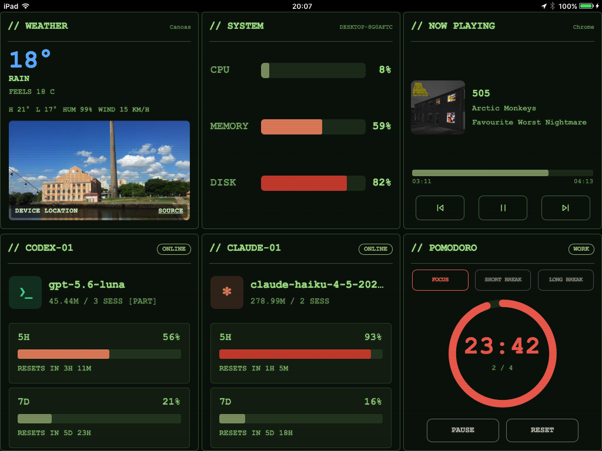

# ROBCO Operations Terminal

Local telemetry dashboard for an older iPad. The computer runs the server; the iPad opens the interface in a browser.



## Run

Requires Python 3.10+.

```powershell
python -m venv .venv
.\\.venv\\Scripts\\python.exe -m pip install -r requirements.txt
.\\.venv\\Scripts\\python.exe app.py
```

Open on the computer:

```text
http://localhost:8080
```

On the iPad, use the computer IP on the same network:

```text
http://IP_DO_COMPUTADOR:8080
```

## What is displayed

The screen contains six cards:

- Weather: city, conditions, metrics and a landmark photo.
- System: CPU, memory and disk.
- Now Playing: current media.
- Codex and Claude: status, model, tokens and limits.
- Pomodoro: focus and breaks.

The layout fills the viewport and is tuned for older Safari/WebKit. There is no top bar or tab navigation.

## Location and weather

The system tries to use the device location. If GPS is unavailable, it uses an approximate IP location. The server fetches weather data and a city photo.

## Security

The server has no authentication and is reachable on the local network. Do not expose port 8080 to the internet.

The dashboard may show the computer name, session IDs, agent usage, current media and approximate location. Passwords, keys, prompts and responses are not sent by the API.

## Tests

```powershell
.\\.venv\\Scripts\\python.exe -m unittest discover -s tests -v
```

With the server running and Playwright installed:

```powershell
.\\.venv\\Scripts\\python.exe tests/check_city_photo.py
```
